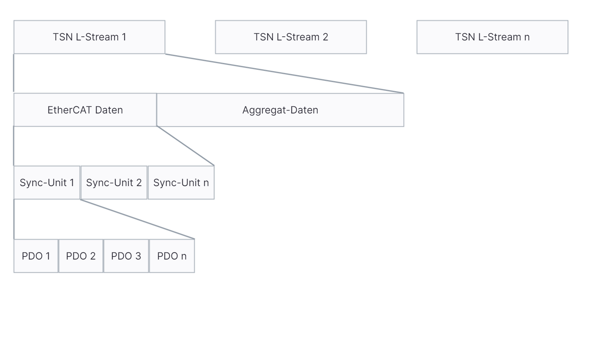

# TSN Data Concept

## Achtung
Dieses Dokument ist ein Entwurf für ein Proof-of-Concept und dient als Diskussionsgrundlage. Es ist außerdem nicht vollständig und wird im Laufe der Entwicklung erweitert und angepasst.

## Data Mapping 


Das Data Mapping soll folgende Anforderungen erfüllen:
1. Es müssen Datenpunkte (Entries) definiert werden können
2. Entries haben eine Quelle und ein Ziel
3. Eine Quelle kann mehrere Ziele haben
4. Ein Ziel kann jedoch nur von einer Quelle bedient werden
5. Das Mapping muss im Echtzeitbetrieb (Produktion) maximal schnell sein, damit eine Gesamtdatenaustauschzeit von 100us nicht überschritten wird. Andernfalls laufen wir Gefahr, dass wir im Gesamtsystem zu wenig Zeit für die weiteren RT-Prozesse übrig haben. 
6. Es darf keine Speicherverletzung durch das Mapping auftreten

## Lösungsansatz
### Data Mapping Objekt
Das Mapping-Objekt enthält einen Container von Entries

:::mermaid
```
classDiagram
    Mapping *-- Entry
    Entry "2"-- Address
    Stream "1"-- Mapping
    class Mapping {
        - entries: Entry[]
        + addEntry(entry: Entry): void
        + removeEntry(entry: Entry): void
        + getEntry(source: Stream, target: Stream): Entry
        + activate(): void
    }
    class Stream{
        - buffer: BufferType
    }
    class Entry {
    }
    class Address {
        - buffer: BufferType
        - offset: unsigned
        - length: unsigned
    }   
```
:::

Die Idee hier ist, dass einzelne Entries zum Mapping hinzugefügt werden können. Ein Entry besteht aus einer Quelle und einem Ziel, wobei beides reine Speicheradressen und Längen sind.
Beim Aufruf der `activate`-Methode wird das Mapping partitioniert, sodass alle Entries, die in der gleichen Quelle liegen nebenainander, nach Adresse sortiert liegen. 
Dann sucht die Methode möglichst große, zusammenhängende Blöcke und trägt für diese Blöcke Quelle-Ziel-Größe in einen Kontainer ein. 
Dieser Container wird dann im Etchzeitbetrieb abgearbeitet. Da hier immer maximale Blöcke genutzt werden, ist die Anzahl der Zugriffe auf den Speicher und damit die Zeit minimal.
Außerdem kann so auch, falls z.B. das gesamte EtherCAT Datagram kommuniziert werden soll, die gesamte Kommunikation durch ein memcpy abgearbeitet werden.


### Notizen
* Das Mapping gehört zu einem Stream, denn es können die Geschwindigkeitssynergien ohnehin nur pro Stream genutzt werden. Außerdem würden wegen Anforderung 3. doppelte Einträge in einem "globalen" Mapping entstehen.

### Timing der Verarbeitungsschritte


Die Choreographie der Verarbeitungsschritte muss so erfolgen, dass die Zeit bis zum vollständigen Datenaustausch minimal gehalten wird. 
Daher ist die Reihenfolge der Verarbeitungsschritte entscheidend. 

Zu Beginn werden parallel auf zwei CPU-Kernen jeweils die ankommenden EtherCAT- und TSN-Daten aufbereitet. Als nächstes wird bereitet jeder Thread zuerst die Daten auf, die der jeweils andere für die weiteren Schritte benötigt. Hierdurch wird die Notwendigkeit des Wartens auf den jeweils anderen minimiert. 
Anschließend werden die Daten, die nicht für den jeweils anderen Thread benötigt werden (Moduldaten für Aggregate etc.), aufbereitet und weitergeleitet. Anschließend und in der Annahme, dass der jeweils andere bis dahin fertig ist, werden die Daten ausgetauscht. 